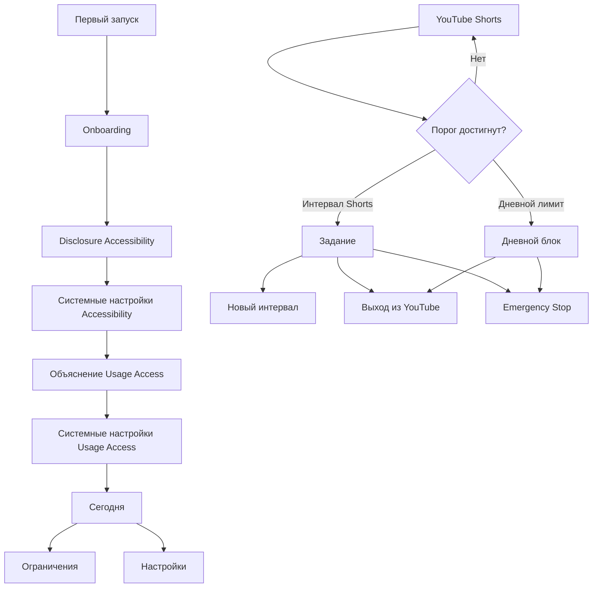

# UX/UI-спецификация NoScrol MVP

Версия: 1.0

Связанный документ: [Продуктовые требования](01-product-requirements.md)

## 1. UX-принципы

1. **Пауза, а не наказание.** Тон спокойный и уважительный; интерфейс не стыдит пользователя.
2. **Пределы понятны заранее.** До просмотра пользователь видит, сколько осталось до задания и дневного лимита.
3. **Выход всегда доступен.** NoScrol не должен ловить пользователя в overlay или мешать системной навигации.
4. **Emergency Stop заметен, но не импульсивен.** Он доступен с блокирующих экранов, однако требует сформулировать причину.
5. **Минимум специальных разрешений.** Каждый системный доступ объясняется непосредственно перед запросом.
6. **Одна главная мысль на экран.** Особенно это относится к onboarding и overlay поверх YouTube.
7. **Не маскироваться под YouTube или Android.** Все блокирующие окна имеют явный бренд NoScrol и собственный визуальный язык.

## 2. Информационная архитектура

Основная навигация MVP состоит из трёх разделов:

- **Сегодня** — статус защиты, прогресс лимитов, Emergency Stop.
- **Ограничения** — пресеты и ручная настройка.
- **Настройки** — системные доступы, данные, приватность и информация о приложении.

Overlay-состояния не входят в обычную навигацию:

- задание после интервала Shorts;
- дневной лимит YouTube;
- форма причины Emergency Stop.

## 3. Основные пользовательские сценарии

### 3.1. Первый запуск

1. Пользователь видит короткое объяснение идеи.
2. Выбирает рекомендованный или другой пресет.
3. Читает отдельный disclosure Accessibility и явно подтверждает переход в настройки.
4. Возвращается в NoScrol; приложение проверяет доступ.
5. Читает объяснение Usage Access для общего дневного лимита.
6. Выдаёт доступ либо продолжает без дневного лимита.
7. Видит итоговую проверку конфигурации.
8. Переходит на экран «Сегодня».

### 3.2. Обычный просмотр Shorts

1. Пользователь открывает Shorts.
2. NoScrol распознаёт экран и считает активное время без видимого вмешательства.
3. После порога появляется gate.
4. Пользователь выбирает:
   - решить пример и получить новый интервал;
   - выйти из YouTube;
   - включить Emergency Stop с причиной.
5. При правильном ответе gate исчезает, а просмотр продолжается.

### 3.3. Достижение дневного лимита

1. Активное время всего YouTube достигает установленного значения.
2. Любая активная поверхность YouTube перекрывается дневным экраном.
3. Пользователь может выйти из YouTube или перейти к Emergency Stop.
4. Задание не предлагается.

### 3.4. Emergency Stop с главного экрана

1. Пользователь включает переключатель.
2. Открывается модальное окно причины.
3. До валидного ввода подтверждение недоступно.
4. После подтверждения появляется постоянный статус «Ограничения отключены».
5. YouTube работает без gate и дневного блока, но время учитывается.
6. Пользователь возвращается в NoScrol и вручную выключает режим.
7. Правила сразу пересчитываются.

### 3.5. Отозванный системный доступ

1. NoScrol обнаруживает недоступный Accessibility или Usage Access.
2. На экране «Сегодня» появляется приоритетная карточка проблемы.
3. Карточка ясно перечисляет неработающие функции.
4. Кнопка ведёт в соответствующий системный экран.
5. Приложение повторно проверяет состояние после возврата.

## 4. Экранная спецификация

### S-001. Приветствие

**Цель:** объяснить результат до запроса разрешений.

Содержимое:

- логотип и рабочее имя NoScrol;
- заголовок: «Остановите автоматический скролл»;
- текст: «NoScrol делает короткую паузу каждые несколько минут Shorts и помогает соблюдать общий лимит YouTube»;
- три тезиса: «Без аккаунта», «Всё хранится на телефоне», «Ограничения можно отключить»;
- основная кнопка: «Настроить»;
- вторичная ссылка: «Как это работает».

### S-002. Выбор режима

**Цель:** дать хороший старт без необходимости понимать все параметры.

Карточки:

- «Мягкий» — 10 мин Shorts / 90 мин YouTube;
- «Сбалансированный» — 5 / 45, бейдж «Рекомендуем»;
- «Строгий» — 2 / 20;
- «Настроить вручную».

Под карточками показывается объяснение:

> Первый параметр — время Shorts до задания. Второй — всё время YouTube за сутки.

Кнопка: «Продолжить».

### S-003. Disclosure Accessibility

**Цель:** выполнить информированное согласие до перехода в Android Settings.

Обязательный текст:

> Чтобы распознавать Shorts и показывать паузу, NoScrol получает события интерфейса только от приложения YouTube. Сервис может видеть элементы активного экрана YouTube и взаимодействовать с ним для показа блокирующего окна. Данные обрабатываются на устройстве: NoScrol не сохраняет содержимое экрана, названия видео, историю просмотров или введённый в YouTube текст и никуда их не отправляет.

Элементы:

- отдельный checkbox: «Я понимаю, зачем нужен доступ»;
- кнопка, активная после checkbox: «Перейти в настройки Android»;
- ссылка: «Политика приватности»;
- вторичная кнопка: «Не сейчас» — оставляет приложение в неактивном состоянии.

Запрещено:

- объединять этот текст с Terms of Service;
- включать checkbox заранее;
- скрывать отказ;
- обещать абсолютную блокировку.

### S-004. Объяснение Usage Access

Текст:

> Для общего дневного лимита NoScrol читает длительность использования YouTube. Доступ не раскрывает содержимое видео или действия внутри YouTube. Без него задания в Shorts продолжат работать, но общий дневной лимит будет недоступен.

Кнопки:

- «Разрешить учёт использования»;
- «Продолжить без дневного лимита».

### S-005. Проверка готовности

Checklist:

- Accessibility Service: включён / не включён;
- Usage Access: включён / пропущен;
- выбранный профиль: название и значения;
- YouTube установлен: да / нет.

Кнопка «Начать» активна при наличии Accessibility. Если YouTube не найден, показывается предупреждение, но настройка может завершиться.

### S-010. Сегодня — нормальное состояние

Верхняя зона:

- заголовок «Сегодня» и локальная дата;
- status chip «Защита работает»;
- меню справки.

Карточка Shorts:

- прогресс текущего интервала;
- «До паузы: 03:42»;
- «Shorts сегодня: 12 мин»;
- подпись «Время сохраняется, если выйти и вернуться».

Карточка YouTube:

- прогресс дневного лимита;
- «Использовано 18 из 45 мин»;
- если лимит выключен — «Дневной лимит выключен»;
- если нет Usage Access — «Недоступно без доступа к статистике» и CTA.

Карточка Emergency Stop:

- переключатель выключен;
- пояснение «Отключает задания и дневной блок до ручного включения».
- если оба ограничения выключены, переключатель disabled и показано «Ограничения уже выключены».

Нижняя навигация: «Сегодня», «Ограничения», «Настройки».

### S-011. Сегодня — Emergency Stop активен

Верхний приоритетный баннер:

- иконка паузы, не системная и не аварийная SOS;
- заголовок «Ограничения отключены»;
- «С 14:32. Учёт времени продолжается»;
- кнопка «Включить блокировку».

Обычные карточки остаются видимыми, но их progress indicators имеют состояние paused/bypassed. Причина не показывается целиком на главном экране из соображений приватности; доступна в локальной истории.

### S-012. Сегодня — проблема разрешений

Если Accessibility выключен:

- красная/контрастная карточка «Защита не работает»;
- текст «NoScrol не может распознавать Shorts или показывать паузу»;
- CTA «Включить Accessibility».

Если выключен только Usage Access:

- янтарная карточка «Дневной лимит приостановлен»;
- текст «Паузы в Shorts продолжают работать»;
- CTA «Включить учёт».

### S-020. Ограничения

Секции:

1. Горизонтальный выбор пресета.
2. «Пауза в Shorts»:
   - master switch;
   - slider/stepper 1–30 минут;
   - текущее значение крупно;
   - recommendation chip у 5 минут.
3. «Дневной YouTube»:
   - master switch;
   - slider/stepper 10–240 минут;
   - recommendation chip у 45 минут.
4. Текстовое резюме будущего поведения.
5. Sticky-кнопка «Сохранить» при наличии изменений.

Пример резюме:

> Через каждые 5 минут Shorts появится пример. После 45 минут всего YouTube приложение будет закрыто до полуночи или Emergency Stop.

Если дневной лимит меньше Shorts-интервала, показать информационное сообщение, но не запрещать сохранение.

### S-030. Настройки

Разделы:

- «Системный доступ»: Accessibility, Usage Access, версия YouTube;
- «Данные»: локальная история Emergency Stop, удалить всю историю;
- «Приватность»: краткое резюме и полный документ;
- «Диагностика»: статус детектора, время последнего распознавания Shorts, без содержимого экрана;
- «О приложении»: версия, лицензии, disclaimer.

### O-001. Gate с заданием

Полноэкранный branded overlay поверх YouTube.

Содержимое:

- логотип/название NoScrol;
- заголовок «Пора сделать паузу»;
- пояснение: «Решите пример, чтобы открыть Shorts ещё на 5 минут»;
- пример крупным шрифтом;
- цифровое поле ответа;
- основная кнопка «Проверить»;
- вторичная кнопка «Выйти из YouTube»;
- текстовая кнопка «Emergency Stop».

Состояния:

- поле пустое — «Проверить» disabled;
- неверно — inline-текст «Не получилось. Попробуйте ещё раз»;
- верно — короткое подтверждение «Готово — ещё 5 минут» и закрытие;
- 3 ошибки — ссылка «Другой пример»;
- дневной лимит достигнут во время gate — замена на O-002.

Back gesture не должен просто закрывать gate и оставлять Shorts доступными. Он трактуется как намерение выйти из YouTube. Home и системная навигация остаются доступны.

### O-002. Дневной лимит

Содержимое:

- заголовок «Дневной лимит YouTube исчерпан»;
- «Сегодня: 45 из 45 минут»;
- «Лимит обновится завтра в 00:00»;
- основная кнопка «Выйти из YouTube»;
- текстовая кнопка «Emergency Stop»;
- задания и кнопки «ещё несколько минут» отсутствуют.

### M-001. Причина Emergency Stop

Открывается как modal sheet внутри NoScrol или как полноэкранный branded слой из overlay.

Тексты:

- заголовок «Отключить все ограничения?»;
- описание: «Задания и дневной лимит не будут появляться, пока вы вручную не включите блокировку снова. Учёт времени продолжится»;
- label поля: «Почему вам нужно отключить блокировку?»;
- placeholder: «Например: смотрю учебную трансляцию»;
- счётчик `0 / 300`;
- основная destructive-кнопка «Отключить блокировку»;
- вторичная кнопка «Отмена».

Валидация:

- меньше 5 символов после trim — кнопка disabled;
- только пробелы — невалидно;
- более 300 символов — дальнейший ввод блокируется или показывается ошибка;
- текст сохраняется только после подтверждения.

### M-002. Подтверждение удаления данных

- заголовок «Удалить локальную историю?»;
- перечислить: дневная статистика, задания, причины Emergency Stop;
- настройки лимитов и системные разрешения не удаляются;
- destructive-кнопка «Удалить историю»;
- «Отмена».

## 5. Состояния компонентов

Каждый интерактивный компонент должен иметь:

- default;
- pressed;
- focused;
- disabled;
- loading, если действие не мгновенное;
- error;
- TalkBack label и role.

Для progress indicators обязательны текстовые значения: цвет не является единственным носителем информации.

## 6. Визуальное направление

### 6.1. Характер

- спокойный, минималистичный, взрослый;
- без игровых streak, красных штрафов и агрессивных формулировок;
- gate визуально заметен, но не имитирует системную ошибку;
- Emergency Stop использует янтарный/терракотовый акцент, а не тревожный SOS-красный.

### 6.2. Система

- Material 3 как базовая система компонентов;
- поддержка светлой и тёмной темы;
- скругления 12–20 dp в обычном UI;
- touch target минимум 48 × 48 dp;
- базовая сетка 8 dp;
- системные insets обязательны для overlay и экранов;
- состояние gate не должно зависеть от фона YouTube: используется полностью непрозрачная или почти непрозрачная поверхность.

### 6.3. Типографика

- системный Android sans-serif;
- крупное выражение задачи: минимум 32 sp;
- основной текст: не менее 16 sp;
- вторичный текст: не менее 14 sp;
- поддержка font scaling до 200% без потери основных действий.

### 6.4. Цвет и контраст

- обычный текст: контраст не ниже 4.5:1;
- крупный текст и графические контролы: не ниже 3:1;
- ошибки сопровождаются текстом и иконкой, а не только цветом;
- динамические Material You цвета допустимы только если сохраняют семантические состояния.

## 7. Доступность

- Все экраны доступны TalkBack.
- Арифметическое выражение читается осмысленно: «семнадцать плюс двадцать шесть».
- Поле ответа получает фокус после открытия gate, но клавиатура не должна закрывать кнопки выхода.
- Порядок фокуса: заголовок → пояснение → пример → ответ → проверить → выйти → Emergency Stop.
- Haptic feedback на правильный/неправильный ответ — опционален и учитывает системные настройки.
- Анимации отключаются или сокращаются при `Remove animations`.
- Overlay поддерживает жестовую и трёхкнопочную навигацию.
- Нельзя перехватывать кнопку питания, шторку уведомлений и системный Home.

## 8. Motion

- Появление gate: fade + небольшое scale, 180–220 мс.
- Неверный ответ: без тряски всего экрана; только короткое появление inline error.
- Верный ответ: checkmark/fade до 300 мс, затем overlay закрывается.
- Смена task gate на дневной лимит происходит без промежуточного показа YouTube.
- При сниженной анимации используется мгновенная смена состояния.

## 9. Контент-стиль

Использовать:

- «пауза», «ограничение», «ещё 5 минут», «сегодня»;
- конкретные значения и время следующего сброса;
- нейтральные ошибки: «Не получилось», «Доступ отключён».

Не использовать:

- «Вы сорвались», «Вы опять тратите время», «Слабая воля»;
- медицинские обещания;
- устрашающие системные формулировки;
- dark patterns для выдачи Accessibility.

## 10. Пустые и ошибочные состояния

| Ситуация | Сообщение | Действие |
|---|---|---|
| YouTube не установлен | «YouTube пока не найден» | «Проверить снова» |
| Shorts ещё не использовались | «Сегодня Shorts ещё не запускались» | Нет обязательного CTA |
| Usage Access пропущен | «Дневной лимит недоступен» | «Разрешить» |
| Accessibility отключён | «Защита не работает» | «Перейти в настройки» |
| Детектор не уверен | Пользователю не показывается блок | Локальный диагностический статус |
| История пуста | «Здесь появятся ваши Emergency Stop» | Нет CTA |
| Полночь наступила внутри YouTube | Прогресс сбрасывается без modal | Продолжить по новому дню |

## 11. Поведение на нестандартных экранах

- **Landscape:** основной UI адаптируется; gate сохраняет все действия без прокрутки по возможности.
- **Большие экраны:** контент ограничен центральной колонкой, максимум 600 dp.
- **Split screen:** enforcement применяется, только когда окно YouTube считается активным/интерактивным.
- **Picture-in-Picture:** не блокируется в MVP и не входит в гарантированный дневной счётчик.
- **Экран выключен:** все таймеры приостанавливаются.
- **YouTube Cast:** время удалённого воспроизведения не считается, если приложение не активно.

## 12. Прототипы, необходимые до разработки

Перед реализацией должны быть проверены кликабельные low-fidelity прототипы:

1. onboarding и два специальных разрешения;
2. экран «Сегодня» в нормальном, emergency и permission-error состояниях;
3. настройка пресета и кастомных значений;
4. gate: пустое поле, ошибка, успех;
5. дневной лимит;
6. Emergency Stop из главного экрана и из overlay;
7. выключение Emergency Stop при уже исчерпанном дневном лимите.
