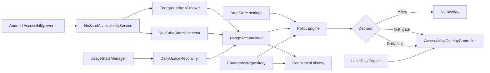
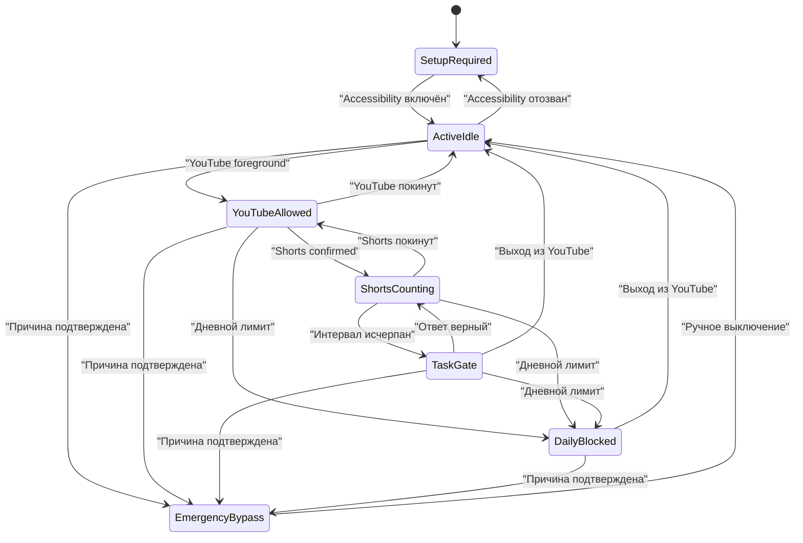

# Техническая архитектура NoScrol MVP

Версия: 1.0

Документ не содержит реализации; он задаёт границы и контракт будущего приложения.

## 1. Архитектурные цели

- Распознавать только Shorts в нативном YouTube.
- Не анализировать сетевой трафик.
- Обрабатывать accessibility-данные локально и эфемерно.
- Разделить распознавание, учёт времени и решение о блокировке.
- Не допускать блокировки при низкой уверенности детектора.
- Сохранять состояние лимитов и Emergency Stop после смерти процесса и reboot.
- Минимизировать специальные Android permissions.
- Позволить в будущем добавить Instagram отдельным detector adapter без переписывания policy engine.

## 2. Платформенная база

Предварительный выбор:

| Область | Решение |
|---|---|
| Язык | Kotlin |
| UI | Jetpack Compose + Material 3 |
| Минимальный Android | Android 8.0, API 26 |
| Compile/target SDK | актуальный стабильный на старте разработки, не ниже требования Google Play |
| Асинхронность | Kotlin Coroutines и Flow |
| Настройки | Preferences DataStore |
| История и агрегаты | Room |
| Dependency injection | Hilt или простой manual DI; финальный выбор до кодирования |
| Время | monotonic clock для активных интервалов, локальная календарная дата для дневного сброса |
| Тесты | JUnit, coroutine test, Robolectric, Compose UI, Espresso/UIAutomator, реальные устройства |

На 14 июля 2026 года новые приложения Google Play должны target Android 15 / API 35 или выше. Перед реализацией требование повторно проверяется по [официальной странице target API](https://developer.android.com/google/play/requirements/target-sdk).

## 3. Высокоуровневая схема



Ключевое правило: detector сообщает наблюдения, но не принимает решение о блокировке. Единственный источник решения — `PolicyEngine`.

## 4. Структура приложения

Для MVP рекомендуется один Gradle-модуль `:app`, разделённый на пакеты. Многомодульность до подтверждения идеи добавит стоимость без продуктовой пользы.

Предлагаемые логические области:

- `onboarding` — объяснения и проверка special access;
- `dashboard` — экран «Сегодня»;
- `limits` — пресеты и пользовательские настройки;
- `settings` — разрешения, данные, privacy;
- `monitoring.accessibility` — Android Accessibility Service;
- `monitoring.detector` — распознавание Shorts;
- `monitoring.usage` — живые и дневные счётчики;
- `policy` — приоритеты и state machine;
- `overlay` — task gate, daily limit, emergency form;
- `tasks` — локальная генерация и проверка примеров;
- `data` — DataStore, Room, repositories;
- `diagnostics` — безопасные агрегированные события без экранного содержимого.

## 5. Android API и системные доступы

### 5.1. AccessibilityService

Основной механизм мониторинга описан в [Android AccessibilityService](https://developer.android.com/reference/android/accessibilityservice/AccessibilityService).

Планируемая конфигурация:

- системная привязка через `BIND_ACCESSIBILITY_SERVICE`;
- `android:packageNames="com.google.android.youtube"`;
- event types:
  - `TYPE_WINDOW_STATE_CHANGED`;
  - `TYPE_WINDOWS_CHANGED` при доступности;
  - `TYPE_WINDOW_CONTENT_CHANGED`;
  - `TYPE_VIEW_SCROLLED`;
- `canRetrieveWindowContent=true`;
- `FLAG_REPORT_VIEW_IDS`, если поддерживается;
- разумный `notificationTimeout` для объединения частых событий;
- `isAccessibilityTool=false`.

Сервис не должен:

- подписываться на все пакеты;
- логировать `AccessibilityNodeInfo.text` или `contentDescription`;
- делать скриншоты;
- передавать дерево за пределы процесса;
- автономно нажимать элементы YouTube;
- пытаться мешать отключению сервиса или удалению приложения.

### 5.2. UsageStatsManager

Для дневного лимита нужен специальный доступ `PACKAGE_USAGE_STATS`, выдаваемый через Android Settings. API описан в [UsageStatsManager](https://developer.android.com/reference/android/app/usage/UsageStatsManager).

Назначение:

- восстановить время YouTube с локальной полуночи после перезапуска процесса;
- сверять локальный live counter;
- показывать дневной прогресс.

UsageStats не используется для распознавания Shorts или свайпов.

### 5.3. Accessibility overlay

Gate и дневной блок создаются сервисом как `TYPE_ACCESSIBILITY_OVERLAY`, описанный в [WindowManager.LayoutParams](https://developer.android.com/reference/android/view/WindowManager.LayoutParams#TYPE_ACCESSIBILITY_OVERLAY).

Преимущества:

- отдельный `SYSTEM_ALERT_WINDOW` не требуется;
- overlay может поглощать касания над YouTube;
- сервис продолжает понимать окно под overlay;
- не нужен запуск Activity из background.

Ограничения:

- системная навигация не блокируется;
- overlay существует только при подключённом Accessibility Service;
- при выходе из YouTube overlay удаляется, но блокирующее состояние сохраняется;
- при возвращении в YouTube overlay восстанавливается.

### 5.4. Package visibility

В manifest указывается точечный `<queries>` для `com.google.android.youtube`. `QUERY_ALL_PACKAGES` запрещён архитектурой MVP.

### 5.5. Явно исключённые механизмы

- `VpnService` — не сообщает о UI и не различает Shorts/обычные видео;
- `SYSTEM_ALERT_WINDOW` — избыточен при Accessibility overlay;
- `INTERNET` — не нужен локальному MVP;
- Device Admin / Device Owner — не соответствует consumer onboarding;
- root/Shizuku — несовместимы с моделью распространения;
- MediaProjection и screenshots — чрезмерный доступ к данным.

## 6. Детектор YouTube Shorts

### 6.1. Входные данные

Детектор получает краткоживущий snapshot доступного дерева активного окна YouTube и метаданные события:

- package name;
- event type и monotonic timestamp;
- class name;
- доступные view IDs;
- role/class узлов;
- текст и content descriptions только для сравнения в памяти с известными сигнатурами;
- scrollability и доступные accessibility actions;
- конфигурацию/размер окна.

После вычисления признаков ссылки на узлы освобождаются. Полные значения текста в логи или БД не записываются.

### 6.2. Модель признаков

Нельзя блокировать по единственному слову `Shorts`. Требуются минимум два независимых признака либо один заранее подтверждённый сильный признак.

Категории:

- **сильные:** стабильный Shorts-specific view ID, уникальная комбинация контейнера и action stack;
- **средние:** выбранная вкладка Shorts, вертикальный полноэкранный pager, характерные action controls;
- **слабые:** локализованный текст `Shorts`, полноэкранное видео, вертикальный scroll event.

Конкретные сигнатуры определяются в discovery-тестах на актуальных версиях YouTube RU/EN до реализации.

### 6.3. Confidence и debounce

Выход детектора:

```text
UNKNOWN | NOT_SHORTS | SHORTS_CONFIRMED
```

Правила:

- `SHORTS_CONFIRMED` требует устойчивого результата не менее 300 мс или двух согласованных событий;
- один отрицательный event не завершает сессию; нужны два отрицательных наблюдения либо смена пакета;
- `UNKNOWN` не включает блокировку и не добавляет время Shorts;
- при несовместимой версии YouTube применяется fail open;
- полный tree scan ограничен максимум двумя в секунду;
- частые `TYPE_WINDOW_CONTENT_CHANGED` агрегируются.

### 6.4. Heartbeat

Autoplay может не создавать регулярный scroll event. После `SHORTS_CONFIRMED` запускается лёгкий tick раз в секунду:

- проверяет, что YouTube остаётся активным;
- проверяет, что экран включён и устройство разблокировано;
- периодически повторно подтверждает сигнатуру;
- передаёт активную секунду в `UsageAccumulator`.

Heartbeat останавливается при смене пакета, выключении экрана, потере уверенности или отключении сервиса.

### 6.5. Версионирование детектора

Так как MVP не использует интернет и remote config:

- правила детектора поставляются с релизом приложения;
- локально хранится версия набора правил;
- неизвестная/сломанная комбинация не блокирует;
- diagnostics хранит только код результата, версию YouTube и счётчик `unknown`, без UI-текста;
- обновление сигнатур требует нового релиза NoScrol.

## 7. Учёт времени

### 7.1. Два независимых счётчика

1. `shortsCycleUsed` — активные секунды Shorts после последнего успешного задания или дневного сброса.
2. `youtubeDailyUsed` — активные секунды всего YouTube с локальной полуночи.

Нельзя выводить один счётчик из другого: дневной YouTube включает обычные видео.

### 7.2. Shorts cycle

- Источник: только подтверждённый detector heartbeat.
- Использует monotonic clock, а не wall clock.
- Сохраняет накопленное значение регулярно и при остановке сессии.
- Выход из Shorts приостанавливает, но не обнуляет цикл.
- Правильный ответ атомарно обнуляет `shortsCycleUsed` и фиксирует новый grant.
- Смена настройки сравнивает уже использованное время с новым limit:
  - если использовано меньше — продолжается оставшееся время;
  - если больше или равно — gate становится due.

### 7.3. Дневной YouTube

Live path:

- Accessibility package/window events определяют, что YouTube активен;
- monotonic accumulator добавляет активные секунды;
- экран off, lock и потеря активного окна останавливают live counter.

Reconciliation path:

- при подключении сервиса;
- при возвращении NoScrol в foreground;
- при открытии YouTube;
- затем не чаще одного раза в 60 секунд активного YouTube;
- запрашиваются UsageEvents от локальной полуночи до текущего времени;
- интервалы `ACTIVITY_RESUMED` / `ACTIVITY_PAUSED` реконструируются для YouTube;
- enforcement использует монотонно неубывающее согласованное значение, чтобы сверка не уменьшала уже показанный прогресс.

Если Usage Access отозван:

- live counter может продолжаться в рамках текущего процесса;
- дневной enforcement официально переводится в состояние unavailable, чтобы не обещать точность;
- Shorts gate продолжает работать;
- UI показывает необходимость восстановить доступ.

### 7.4. Что считается активным временем

В MVP считается:

- YouTube — активное интерактивное окно;
- устройство разблокировано;
- экран включён.

Не гарантируется и исключается из acceptance:

- Picture-in-Picture;
- фоновое аудио;
- Cast playback;
- YouTube в браузере;
- YouTube Music;
- неактивная половина split screen.

### 7.5. Дневной сброс

- Ключ записи — локальная `LocalDate`.
- При первой активности после смены даты создаётся новая дневная запись.
- `shortsCycleUsed` обнуляется.
- Emergency Stop не выключается и продолжает действовать на следующий день.
- Изменение timezone обрабатывается как смена локальной даты без наказаний и anti-tamper логики.
- Если полночь наступает при активном YouTube, новый день применяется на следующем tick.

## 8. Policy Engine

### 8.1. Входы

- системные доступы;
- текущий foreground package;
- detector state;
- `shortsCycleUsed`;
- `youtubeDailyUsed`;
- настройки лимитов;
- Emergency Stop;
- состояние экрана/lock;
- наличие активного задания.

### 8.2. Выходы

```text
UNENFORCED_SETUP_REQUIRED
ALLOW
COUNT_YOUTUBE
COUNT_SHORTS
SHOW_TASK_GATE
SHOW_DAILY_LIMIT
EMERGENCY_BYPASS
```

### 8.3. Приоритет вычисления

1. Если Emergency Stop активен → `EMERGENCY_BYPASS`.
2. Если Accessibility недоступен → `UNENFORCED_SETUP_REQUIRED`.
3. Если YouTube не активен → `ALLOW`, overlay удаляется.
4. Если дневной limit включён, доступен и исчерпан → `SHOW_DAILY_LIMIT`.
5. Если Shorts подтверждён и cycle limit исчерпан → `SHOW_TASK_GATE`.
6. Если Shorts подтверждён → `COUNT_SHORTS` и `COUNT_YOUTUBE`.
7. Иначе при активном YouTube → `COUNT_YOUTUBE`.

### 8.4. State machine



## 9. Overlay Controller

### 9.1. Общие правила

- В процессе существует не более одного blocking overlay.
- Команды idempotent: повторный `SHOW_TASK_GATE` не создаёт второе окно.
- Daily limit имеет приоритет и заменяет task gate без короткого раскрытия YouTube.
- При уходе с YouTube view удаляется, но policy state остаётся blocked.
- При возврате overlay восстанавливается до показа контента по возможности, но абсолютная zero-frame гарантия невозможна.
- Overlay получает собственные lifecycle/state holders, необходимые Compose UI.

### 9.2. Выход из YouTube

Кнопка «Выйти из YouTube» выполняет заранее определённое действие навигации назад или Home. Это детерминированная пользовательская команда, а не автономная AI-автоматизация.

Системный Back не должен превращаться в bypass. Предпочтительное поведение:

- трактовать Back как «Выйти из YouTube»;
- удалить overlay после подтверждённой смены foreground package;
- если навигация не удалась, оставить overlay и показать кнопку Home-инструкции.

### 9.3. Emergency form из overlay

- Форма является состоянием существующего overlay.
- Отмена возвращает прежнее task/daily состояние.
- Подтверждение атомарно записывает событие Emergency, меняет policy и удаляет blocking view.
- Текст причины не отображается над YouTube после сохранения.

## 10. Task Engine

### 10.1. Генерация

Локальный генератор выбирает один из трёх шаблонов:

- `a + b`, `a,b ∈ [10,99]`;
- `a − b`, `a,b ∈ [10,99]`, `a ≥ b`;
- `a × b`, `a,b ∈ [2,9]`.

Результат всегда целый и однозначный. Деление, дроби, отрицательные результаты и текстовые задачи исключены.

### 10.2. Состояние

`PendingTask` содержит:

- ID;
- тип операции;
- операнды;
- ожидаемый ответ;
- время создания;
- число неверных попыток;
- состояние solved.

Ожидаемый ответ хранится локально. Это не security boundary: задача создаёт friction, а не защищает секрет.

### 10.3. Атомарность разблокировки

При верном ответе одна транзакция:

1. отмечает task solved;
2. записывает попытку в агрегаты;
3. обнуляет `shortsCycleUsed`;
4. удаляет `PendingTask`;
5. публикует новое policy state.

Сбой между шагами не должен приводить к повторной выдаче времени или вечному solved overlay.

## 11. Модель данных

### 11.1. DataStore: `UserSettings`

| Поле | Тип | Default |
|---|---|---|
| `onboardingCompleted` | Boolean | false |
| `shortsGateEnabled` | Boolean | true |
| `shortsIntervalMinutes` | Int | 5 |
| `dailyLimitEnabled` | Boolean | true |
| `dailyLimitMinutes` | Int | 45 |
| `preset` | Enum | BALANCED |
| `emergencyActive` | Boolean | false |
| `accessibilityDisclosureAcceptedAt` | Instant? | null |
| `usageDisclosureSeenAt` | Instant? | null |
| `detectorRulesVersion` | Int | build default |
| `settingsSchemaVersion` | Int | 1 |

`emergencyActive` хранится так, чтобы быть доступным service layer сразу после старта. Причина хранится в Room, не в Preferences.

### 11.2. Room: `DailyUsage`

| Поле | Назначение |
|---|---|
| `localDate` | primary key |
| `youtubeSeconds` | согласованное дневное время |
| `shortsSeconds` | суммарное Shorts-время |
| `emergencyYoutubeSeconds` | YouTube во время bypass |
| `gatesShown` | число gate |
| `tasksSolved` | решённые задания |
| `taskExits` | выходы из YouTube с gate |
| `lastUpdatedElapsed` | защита от двойного live-count внутри boot |
| `updatedAtWallClock` | отображение/диагностика |

### 11.3. Room: `GateCycle`

| Поле | Назначение |
|---|---|
| `id` | singleton/current ID |
| `localDate` | день цикла |
| `usedSeconds` | накопленное Shorts-время |
| `pendingTaskId` | nullable |
| `updatedAt` | восстановление |

### 11.4. Room: `EmergencyEvent`

| Поле | Назначение |
|---|---|
| `id` | UUID |
| `reason` | 5–300 символов, локально |
| `activatedAt` | wall clock instant |
| `deactivatedAt` | nullable instant |
| `activationSource` | DASHBOARD / TASK_GATE / DAILY_LIMIT |
| `youtubeSecondsDuring` | агрегат |

### 11.5. Room: `TaskAttemptAggregate`

MVP не обязан хранить каждый введённый ответ. Достаточно:

- task ID;
- operation type;
- attempts count;
- solved/exit;
- timestamps.

Пользовательский неправильный ввод не сохраняется.

### 11.6. Diagnostics

Разрешено хранить:

- версия NoScrol;
- версия YouTube;
- версия detector rules;
- counts `confirmed`, `unknown`, `overlay_show_failed`;
- код последней ошибки;
- timestamps.

Запрещено хранить:

- заголовки видео;
- имена каналов;
- комментарии;
- запросы поиска;
- accessibility text/content descriptions;
- screenshots;
- URL и сетевые адреса.

## 12. Конкурентность и консистентность

- Policy state имеет один сериализованный источник обновлений.
- События Accessibility поступают в buffered stream с coalescing.
- Все изменения счётчиков проходят через один repository/actor или Mutex.
- Database writes выполняются вне main thread.
- Overlay commands сериализуются.
- Wall clock не используется для измерения активной длительности внутри сессии.
- После reboot монотонные значения предыдущего boot не сравниваются напрямую; состояние восстанавливается из сохранённых секунд и UsageStats.

## 13. Lifecycle и восстановление

### 13.1. Process death

- Emergency flag уже сохранён и применяется первым.
- Gate cycle восстанавливается из Room.
- Pending task восстанавливается, если gate всё ещё due.
- Дневное время сверяется с UsageStats.
- Overlay создаётся только после подтверждения foreground YouTube.

### 13.2. Reboot

Не требуется самостоятельно запускать обычный foreground service. Accessibility Service подключается системой после разблокировки/готовности пользователя.

После подключения:

1. загрузить settings;
2. определить локальную дату;
3. восстановить Emergency;
4. сверить usage;
5. начать наблюдение;
6. не показывать overlay до активного YouTube.

### 13.3. Accessibility отключён

- Системный overlay исчезает автоматически.
- NoScrol сохраняет лимиты, Emergency и историю.
- При следующем открытии показывается критический status card.
- Приложение не имитирует работающую защиту.

### 13.4. YouTube обновился

- detector может перейти в `UNKNOWN`;
- Shorts не блокируются;
- дневной лимит всего YouTube продолжает работать, если foreground package определяется;
- diagnostics показывает «Распознавание Shorts требует проверки»;
- исправление поставляется обновлением NoScrol.

## 14. Производительность и батарея

- Event filter ограничен YouTube package.
- Content events coalesce в окно 100–250 мс.
- Tree scan максимум 2/сек и только при активном YouTube.
- Heartbeat 1/сек работает только в подтверждённом Shorts/YouTube session.
- Room не обновляется каждую секунду: live seconds буферизуются и записываются, например, каждые 10–15 секунд и при session boundary.
- UsageStats reconciliation не чаще 1/60 сек активного YouTube.
- UI dashboard наблюдает агрегированные Flow, а не accessibility nodes.

Целевые бюджеты уточняются профилированием:

- отсутствие заметных jank в YouTube из-за NoScrol;
- отсутствие постоянного CPU wake вне активного YouTube;
- отсутствие network wakeups;
- отсутствие удержания accessibility tree после обработки.

## 15. Безопасность реализации

- Все Activity/Receiver/Service имеют минимально необходимый `exported`.
- Accessibility Service защищён системным bind permission.
- Room и DataStore находятся в app-private storage.
- Backup для причин Emergency Stop выключен либо данные исключены из cloud backup.
- Clipboard не используется для причины или ответа.
- Logs production-сборки не содержат пользовательских текстов.
- Debug diagnostics очищаются перед release или используют redact.
- Компоненты overlay не принимают внешние intents с произвольным содержимым.

## 16. План тестируемости

Для каждого внешнего API нужен interface/adapter:

- `AccessibilityEventSource`;
- `WindowSnapshotProvider`;
- `UsageStatsSource`;
- `MonotonicClock` и `WallClock`;
- `OverlayHost`;
- `SettingsRepository`;
- `EmergencyRepository`.

Это позволяет unit-тестировать detector, counters и policy без реального устройства. Реальное взаимодействие Accessibility/overlay подтверждается instrumented и manual tests.

## 17. Наблюдаемость без нарушения приватности

В debug/pilot build доступен локальный экран:

- package foreground: yes/no;
- detector state;
- confidence category без найденных текстов;
- Shorts cycle seconds;
- daily YouTube seconds;
- policy decision;
- overlay state;
- version codes.

Экспорт возможен только по явному действию пользователя и содержит те же redacted-поля. В production MVP экспорт можно не включать.

## 18. Открытые технические проверки до кодирования

1. Снять accessibility snapshots актуального YouTube RU/EN на нескольких устройствах.
2. Подтвердить стабильные комбинации признаков Shorts.
3. Проверить `TYPE_ACCESSIBILITY_OVERLAY` с Compose, IME и системным Back на API 26, 33, 35 и latest stable.
4. Сравнить UsageEvents с ручным секундомером на Pixel/Samsung/Xiaomi.
5. Проверить split screen и PiP, чтобы они не создавали ложный блок.
6. Проверить restricted settings при sideload на Android 13+.
7. Уточнить актуальный target SDK и Accessibility declaration перед публикацией.
