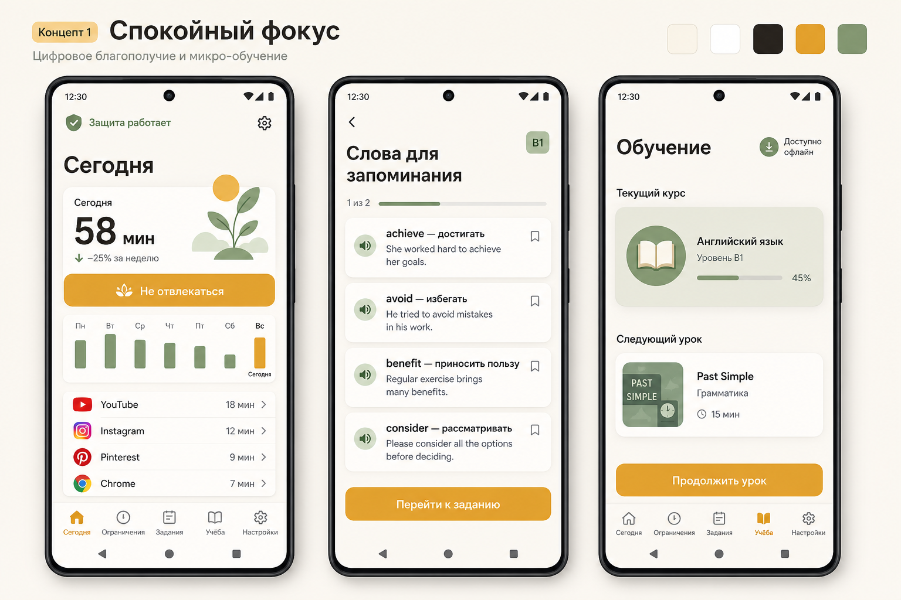
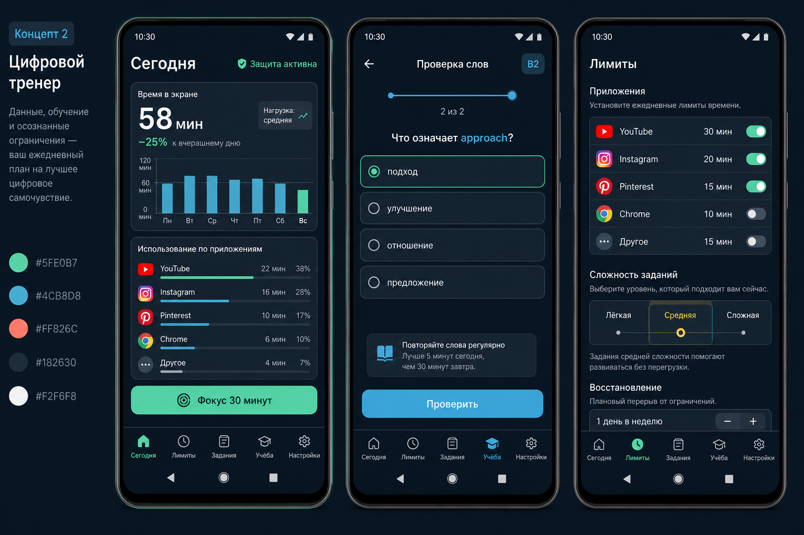
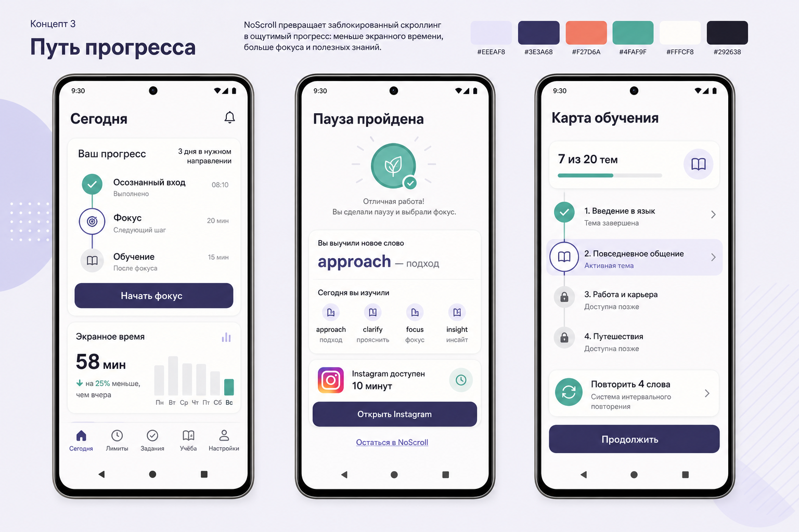

# Направления редизайна NoScroll

Документ фиксирует три независимых UX/UI-направления для выбора перед реализацией. Макеты задают
иерархию, характер и основные компоненты, но не являются пиксельными контрактами: финальные экраны
будут собраны на Jetpack Compose, адаптированы к системным шрифтам, тёмной/светлой теме и реальным
данным NoScroll.

## Общие правила для всех вариантов

- Главный экран сначала показывает состояние защиты и наиболее важное действие, затем статистику,
  затем подробности отдельных ограничений.
- Ошибка Accessibility или Usage Access всегда заметнее обычной статистики.
- Задание остаётся внутри NoScroll и состоит из понятных этапов: материал → вопрос → результат.
- Системные панели Android и жест «Назад» остаются доступными.
- Emergency Stop доступен, но визуально не конкурирует с ежедневными действиями.
- Интерфейс поддерживает увеличение системного шрифта до 200%, TalkBack, контраст и цели касания не
  меньше 48 dp.
- Красный цвет используется только для ошибки, роста экранного времени или опасного действия.
- Реальные названия приложений, значения лимитов и статистика берутся из состояния, а не вшиваются
  в экран.

## Концепция 1 — «Спокойный фокус»

### Идея

NoScroll ощущается как тихий помощник. Большие поля, тёплый фон, немного карточек и одна основная
кнопка на экран уменьшают напряжение в момент блокировки.

### UX-шаблон

1. «Сегодня»: статус защиты → суммарное время и тренд → «Не отвлекаться» → семь дней → приложения.
2. Задание: отдельный экран изучения → отдельный экран вопроса → короткое подтверждение доступа.
3. «Обучение»: один текущий курс и один следующий урок без перегруженного каталога.
4. Детальные интервалы и служебная диагностика остаются на дочерних экранах.

### UI-токены

- фон `#F7F3EA`;
- основной текст `#25221D`;
- действие `#D7A928`;
- успех и обучение `#7C9272`;
- карточки: 20–24 dp, внутренний отступ 20 dp;
- числа статистики: крупнее заголовков, без декоративных графиков.

### Сильные стороны и риск

Лучше всего соответствует спокойной борьбе с думскроллингом и подходит широкой аудитории. Риск —
пользователю, любящему подробную аналитику, придётся открывать дополнительные экраны.

## Концепция 2 — «Цифровой тренер»

### Идея

NoScroll ощущается как точный аналитический инструмент. Тёмная тема, компактные строки и выраженные
графики делают изменения поведения измеримыми.

### UX-шаблон

1. «Сегодня»: общий показатель → тренд → недельный график → вклад приложений → быстрый фокус.
2. Задание: максимум информации на одном экране, но материал и ответ всё равно разделены этапом.
3. «Лимиты»: приложение, переключатель и интервал в одной строке; шкала сложности рядом.
4. Для каждой метрики доступно объяснение способа расчёта.

### UI-токены

- фон `#101820`;
- поверхность `#182630`;
- основное действие и успех `#5FE0B7`;
- данные `#4CB8D8`;
- предупреждение `#FF826C`;
- карточки: 14–18 dp, внутренний отступ 16 dp;
- числа используют табличные цифры, графики — только плоские 2D.

### Сильные стороны и риск

Лучше показывает ценность статистики и подходит опытному пользователю. Риск — высокая плотность
может восприниматься как контроль и наказание, особенно во время обязательной паузы.

## Концепция 3 — «Путь прогресса»

### Идея

NoScroll связывает отказ от скроллинга с видимым полезным результатом. Основной образ — путь из
осознанного входа, фокуса и обучения, а не набор запретов.

### UX-шаблон

1. «Сегодня»: последовательность полезных шагов → CTA текущего шага → экранное время и тренд.
2. После задания появляется отдельный результат: что изучено, какое приложение и на сколько минут
   разблокировано, возможность остаться в NoScroll.
3. «Обучение»: карта тем, активный узел и отдельный блок интервального повторения.
4. Прогресс выражается завершёнными действиями и знаниями, без очков, монет и рейтингов.

### UI-токены

- фон `#EEEAF8` и `#FFFCF8`;
- основной текст `#292638`;
- основное действие `#3E3A68`;
- прогресс `#4FAF9F`;
- акцент `#F27D6A`;
- карточки: 18–22 dp, внутренний отступ 18–20 dp;
- соединённые узлы используются только для реальной последовательности, не как декор.

### Сильные стороны и риск

Самое уникальное направление и лучше всего связывает ограничения с обучением. Риск — наибольший
объём UX-переделки и необходимость аккуратно не превратить прогресс в навязчивую серию дней.

## Сравнение

| Критерий | Спокойный фокус | Цифровой тренер | Путь прогресса |
|---|---|---|---|
| Эмоция | спокойствие | контроль и ясность | развитие |
| Плотность | низкая | высокая | средняя |
| Статистика | краткая | главная | поддерживающая |
| Обучение | отдельный раздел | один из инструментов | часть основного сценария |
| Объём реализации | средний | средний | высокий |
| Риск перегрузки | низкий | высокий | средний |

## Рекомендация

Для текущей концепции NoScroll наиболее безопасная основа — вариант 1. Оптимальный гибрид:

- визуальная система и спокойная иерархия варианта 1;
- разворачиваемая аналитика из варианта 2;
- экран результата задания и карта обучения из варианта 3.

Пользователь может выбрать чистый вариант `1`, `2`, `3` либо гибрид `1+2+3`. После выбора следует
сначала зафиксировать дизайн-токены и общие компоненты, затем по одному перенести «Сегодня»,
задание, ограничения, обучение и настройки с сохранением всей текущей бизнес-логики.
